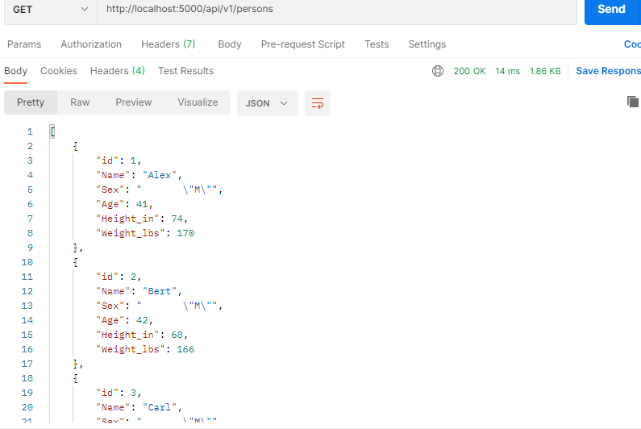
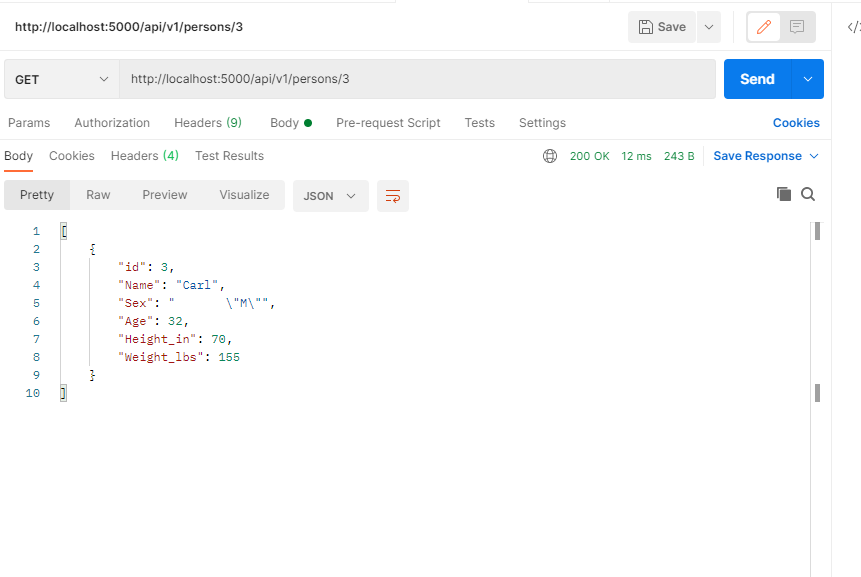
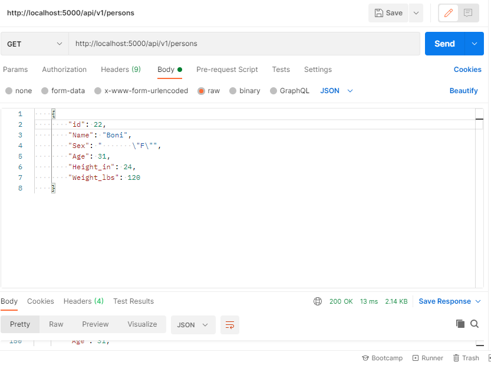
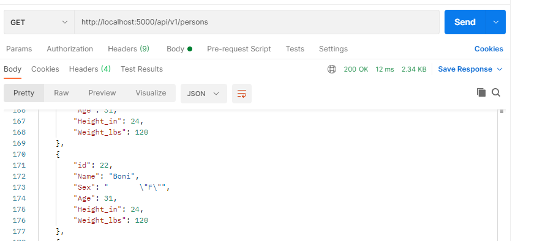
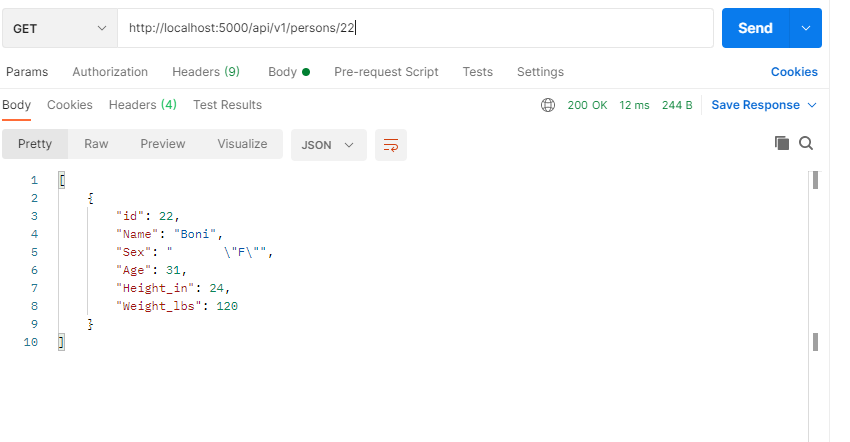
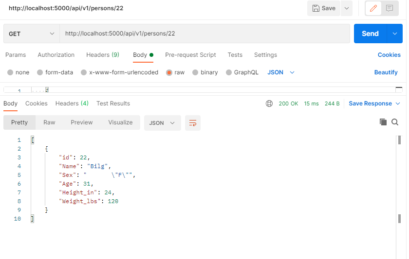
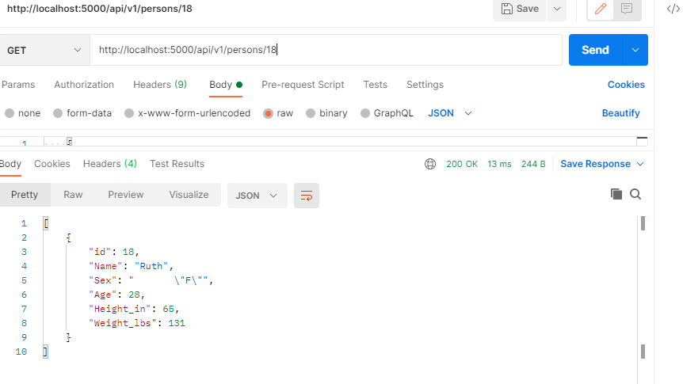
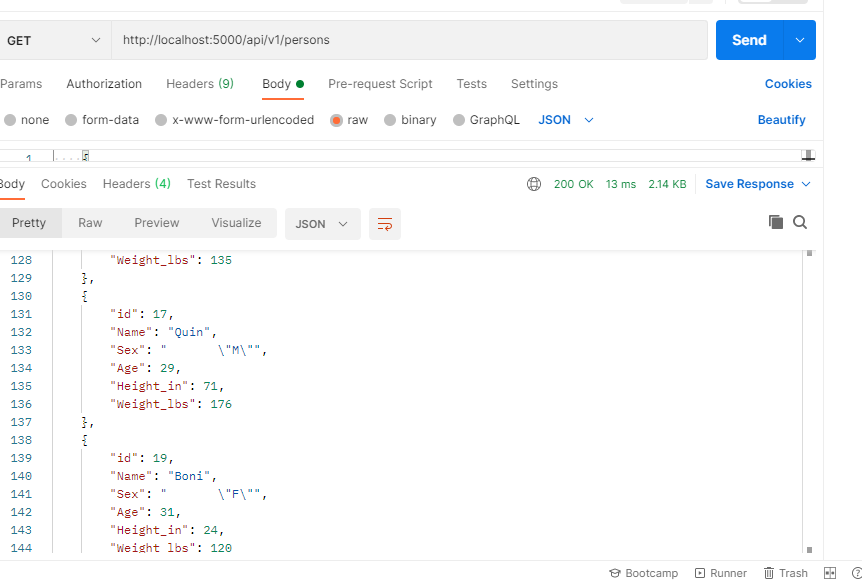

# Project Description
This project is a homework assignment to teach how to get Pycharm setup with Docker, Flask, MySQL, and Postman
#Postman Results

*Lesson 3 at bottom*

#List All Records

#One get request

#Before Post Request

#After Post Request

#Before Put request

#After Put Request

#Before delete request

#After delete Request

#Biostats Data Table

#Home Page

#A Single Record

#Adding a Person
Before Adding a Person

After Adding a Person

#Editing a Person
Before editing

After editing

#Deleting a Person
Abby has been deleted

